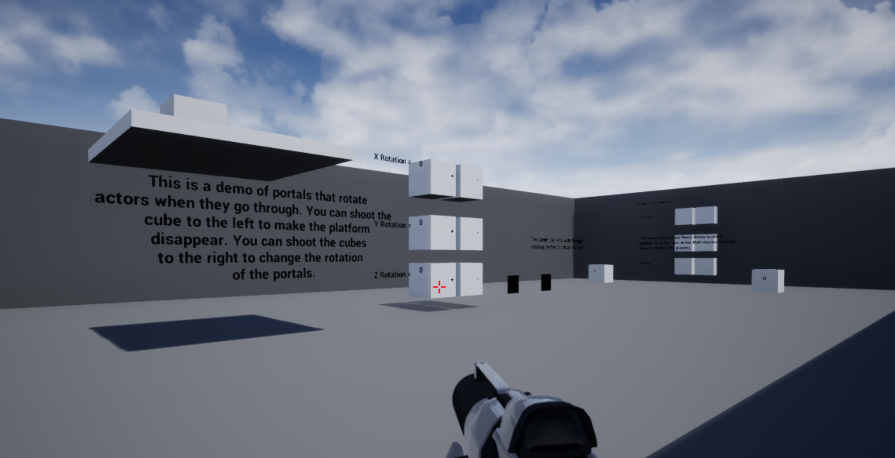

[Resume](Resume.pdf)
# Projects

### **Gestalt**

Game created as a production project about a moth that is in search of a new home after its old home burned down.

* [Latest Release](https://team-forest.itch.io/gestalt)

### **Portal Demo**

Demo showing different portals I made in UE4 using C++.

* [Source](https://github.com/SheltonThomas/Portals)
* [Latest Release](https://github.com/SheltonThomas/Portals/releases/tag/1)

### **Labyrinth of the Crystal Cheese**

A cat and mouse game where you play a wizard mouse trying to collect more crystal cheese than the dragon cat in the labyrinth. Make sure not to let the cat catch you!

* [Source](https://github.com/SheltonThomas/LabyrinthOfTheCrystalCheese)
* [Latest Release](https://g1itch4tron.itch.io/labyrinthofthecrystalcheese)

### **Asteroid Game**

A cat and mouse game where you play a wizard mouse trying to collect more crystal cheese than the dragon cat in the labyrinth. Make sure not to let the cat catch you!

* [Source](https://github.com/SheltonThomas/Asteroid-Game)
* [Latest Release](https://github.com/SheltonThomas/Asteroid-Game/releases/tag/1.0)

### **RunnerGame**

Auto scrolling shooter game made in Unity and made with WebGl in mind.

* [Source](https://github.com/SheltonThomas/RunnerGame)
* [Latest Release](https://SheltonThomas.github.io/RunnerGame/player/)
