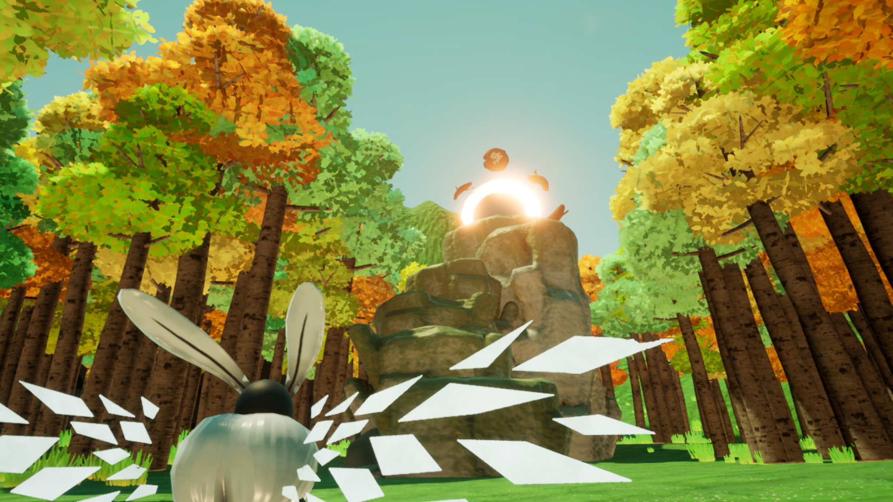
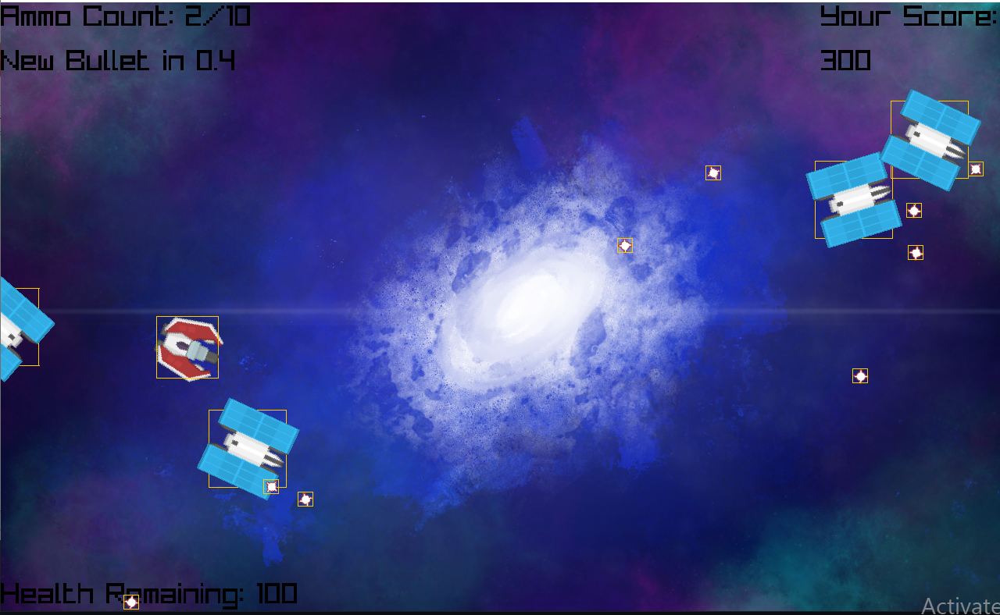
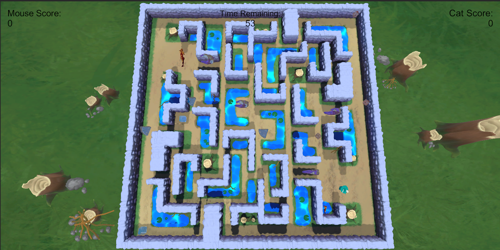

# Projects

### **Gestalt**



Game created as a production project about a moth that is in search of a new home after its old home burned down.

* [Latest Release](https://team-forest.itch.io/gestalt)

### **Portal Demo**



Demo showing different portals I made in UE4 using C++.

* [Source](https://github.com/SheltonThomas/Portals)
* [Latest Release](https://github.com/SheltonThomas/Portals/releases/tag/1)

### **Labyrinth of the Crystal Cheese**



A cat and mouse game where you play a wizard mouse trying to collect more crystal cheese than the dragon cat in the labyrinth. Make sure not to let the cat catch you!

* [Source](https://github.com/SheltonThomas/LabyrinthOfTheCrystalCheese)
* [Latest Release](https://g1itch4tron.itch.io/labyrinthofthecrystalcheese)

# Header 1
## Header 2
### Header 3

- Bulleted
- List

1. Numbered
2. List

**Bold** and _Italic_ and `Code` text

[Link](url) and 
```

For more details see [GitHub Flavored Markdown](https://guides.github.com/features/mastering-markdown/).

### Jekyll Themes

Your Pages site will use the layout and styles from the Jekyll theme you have selected in your [repository settings](https://github.com/SheltonThomas/SheltonThomas.github.io/settings/pages). The name of this theme is saved in the Jekyll `_config.yml` configuration file.

### Support or Contact

Having trouble with Pages? Check out our [documentation](https://docs.github.com/categories/github-pages-basics/) or [contact support](https://support.github.com/contact) and we’ll help you sort it out.
